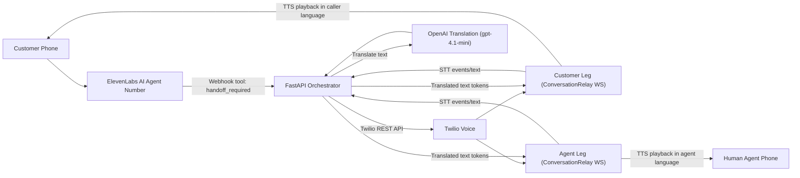

# Architecture (Phase 1-3 MVP)

## Objective

Create a clean baseline for near-real-time translation over Twilio ConversationRelay while keeping the code ready for future dual-leg routing.

## High-Level Design (Demo View)

### System goal

Provide AI-first intake with live human handoff and near-real-time bilingual speech translation during a phone call.

### Block diagram

### Runtime responsibilities

1. ElevenLabs handles first-contact conversation and decides when handoff is needed.
2. FastAPI validates webhook security, orchestrates Twilio legs, and routes translation turns.
3. ConversationRelay streams transcribed utterances to websocket and speaks returned translated tokens.
4. OpenAI translator converts utterance text between caller and agent languages turn-by-turn.
5. Language policy is explicit:
   - caller language can be auto-detected (`caller_language=auto`)
   - agent side remains English (`DEFAULT_AGENT_LANGUAGE=en-US`)

## Components

1. **FastAPI service (`app/main.py`)**
   - Receives inbound voice webhook from Twilio.
   - Returns TwiML with `<Connect><ConversationRelay>`.
   - Hosts websocket endpoint for ConversationRelay events.

2. **Configuration (`app/config.py`)**
   - Centralized environment settings for:
     - URLs and host/port
     - default caller/agent languages
     - translation provider
     - security flags (signature validation)

3. **Event models (`app/models.py`)**
   - Parses flexible websocket payloads.
   - Handles unknown/new event shapes gracefully.
   - Generates safe text fingerprints for logging.
   - Builds outbound text token messages.

4. **Translation layer (`app/translation.py`)**
   - `Translator` protocol abstraction.
   - `MockTranslator` for deterministic local tests.
   - `OpenAITranslator` for env-gated runtime translation.

5. **Bridge session scaffold (`app/session_bridge.py`)**
   - In-memory registry for websocket participants grouped by `session_id`.
   - Tracks basic leg identity (`caller`, `agent`, `unknown`).
   - Exposes active session counts for health/debug.

6. **Handoff orchestrator (`app/handoff.py`)**
   - Receives ElevenLabs handoff intent payload.
   - Validates minimal handoff inputs.
   - Orchestrates Twilio human handoff bridge (dry-run or live).

7. **Latency tracker (`app/latency.py`)**
   - Collects per-turn latency measurements in memory.
   - Exposes aggregate and recent metrics for tuning turn-based UX.

## Request and websocket flow

1. Twilio sends `POST /voice/incoming`.
2. Service returns TwiML:
   - `<Connect>`
   - `<ConversationRelay url="wss://.../ws/conversationrelay?...">`
3. Twilio opens websocket to `/ws/conversationrelay`.
4. Service registers participant by:
   - `session_id` query param
   - `leg` query param (`caller` default)
5. Service parses incoming JSON frames:
   - ignores unknown/non-text safely
   - translates text via selected provider
   - streams translated text as token messages
   - records per-turn latency metrics (ingest, translate, emit, estimated TTS)

## ElevenLabs handoff flow (Phase 3)

1. ElevenLabs posts handoff request to `POST /handoff/elevenlabs`.
2. API validates shared secret header when enabled.
3. Handoff orchestrator builds conference plan and executes:
   - dry-run mode: generates deterministic fake SIDs for local testing
   - live mode:
     - primary path updates existing Twilio caller leg using `twilio_call_sid`
     - default fallback re-dials customer leg when SID is missing (`ENABLE_CUSTOMER_RECONNECT=true`)
     - dials human agent leg
     - joins legs in conference
4. API returns handoff metadata (conference name, session id, call SIDs).

### Seamless handoff guardrails

1. Default operating mode allows callback fallback when SID is missing:
   - `REQUIRE_ACTIVE_CALL_SID_FOR_HANDOFF=false`
   - `ENABLE_CUSTOMER_RECONNECT=true`
2. Strict seamless-only mode is optional:
   - set `REQUIRE_ACTIVE_CALL_SID_FOR_HANDOFF=true` to require live SID and reject missing SID requests.
3. Callback fallback is explicitly observable and logs `FALLBACK_RECONNECT_USED`.

## End-to-end translation sequence (live call)

1. Customer calls ElevenLabs number.
2. ElevenLabs gathers intent and triggers `POST /handoff/elevenlabs` when escalation is required.
3. FastAPI orchestrator creates/updates Twilio call legs and points both legs to `/ws/conversationrelay`.
4. Twilio sends per-turn speech/transcript events over websocket.
5. FastAPI translates text using configured provider (`openai` or `mock`).
6. FastAPI sends translated text tokens back over websocket.
7. Twilio performs TTS playback of translated content to the opposite leg.
8. Loop continues for natural turn-based bilingual conversation.

## Logging and privacy posture

- Logs avoid raw transcript text.
- Logs include:
  - event type
  - call SID
  - text length
  - short SHA-256 fingerprint

## Security baseline

- `POST /voice/incoming` supports Twilio signature validation.
- Enforce with:
  - `REQUIRE_TWILIO_SIGNATURE=true`
  - `TWILIO_AUTH_TOKEN` configured.
- ElevenLabs webhook shared-secret validation is supported via:
  - `REQUIRE_ELEVENLABS_HANDOFF_SECRET=true`
  - `ELEVENLABS_HANDOFF_SECRET`
  - `X-ElevenLabs-Handoff-Secret` request header

## Future design for dual-leg bridge

Planned additions:

1. **Direction-aware routing hardening**
   - Caller leg: `sv-SE -> en-US`
   - Agent leg: `en-US -> sv-SE`
2. **Turn management**
   - Suppress overlapping speech.
   - Push translated text/audio only on stable turn boundaries.
3. **Failover behavior**
   - Degrade to source language or fallback prompts if translation provider fails.
4. **Metrics**
   - Measure event-to-token latency and end-to-end turn latency.
5. **Persistent session state**
   - Move registry from memory to a shared/stateful backend for multi-worker deployments.
